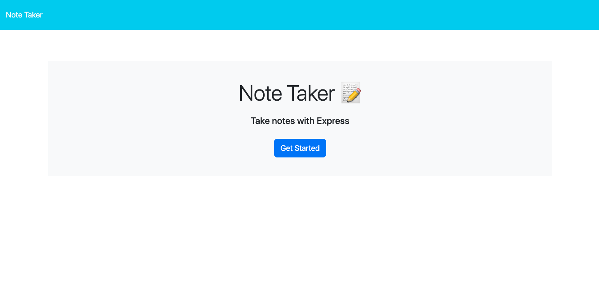
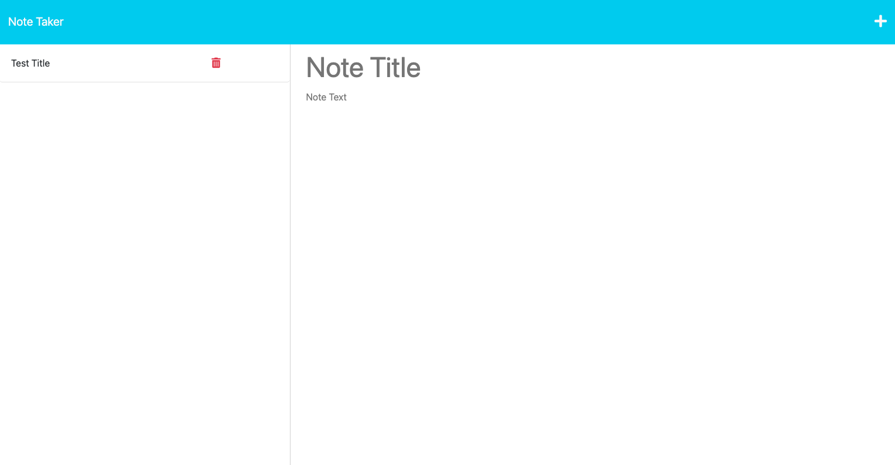

# Note Taker Application

[Link to deployed application](https://whispering-beyond-64371.herokuapp.com/)

## Table of Contents
- [Description](#Description)
- [Usage](#Usage)
- [Visuals](#Visuals)

## Description

This application allows users to input notes with a title and a description, while also allowing them to save for future review. When the application loads, the user is presented with a landing page with a "Get Started" button that--when clicked--will present the user with the note-taking page where they can add in their notes.

## Usage
To use the Note Taker Application, click the blue "Get Started" button on the landing page. Once clicked, you should be presented with a new page that allows you to add notes and see existing ones. To add a note, simply type into the text box area with a label of "Note Title" and "Note Text". Once you have completed the note, click the save icon that is in the upper right hand corner next to the "+" symbol. This will add the note to the left aside.

To view existing notes, you can click on the note in the left aside and it will appear in the main section. If you'd like to add a new note, you can click the "+" symbol, and you will be presented with a fresh section to start typing. Upon refresh, all saved notes should appear via local storage.

## Visuals

